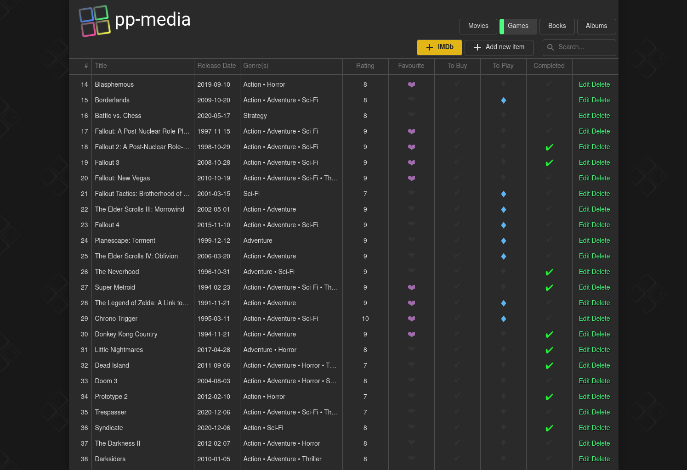

# pp-media

## Description
Application for storing informations about movies, games, books and music albums developed using Symfony and React.



## Initialize docker containers
- Copy `env.example` to `.env` and change variables if needed.
- Running ```docker-compose up``` should do the job.
